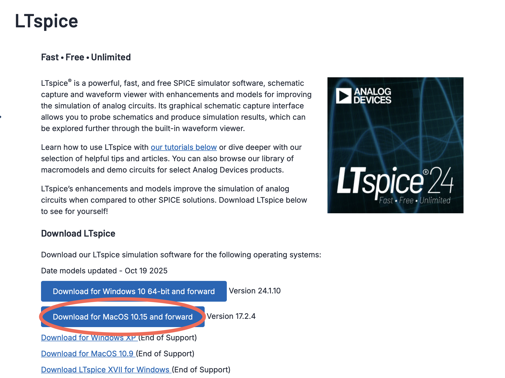
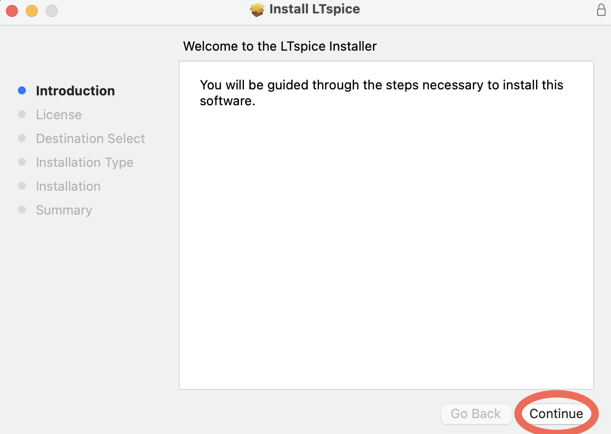
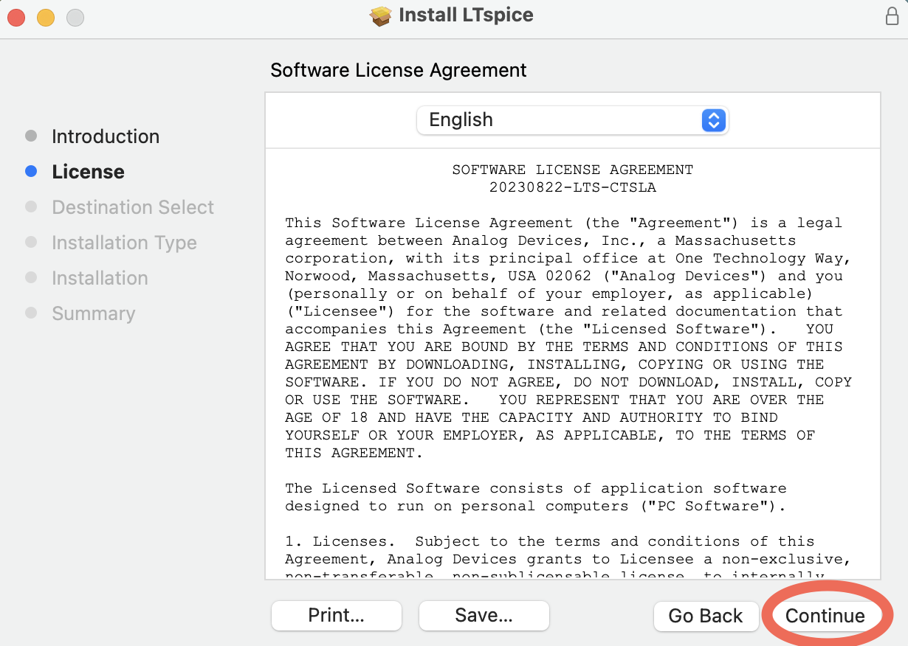
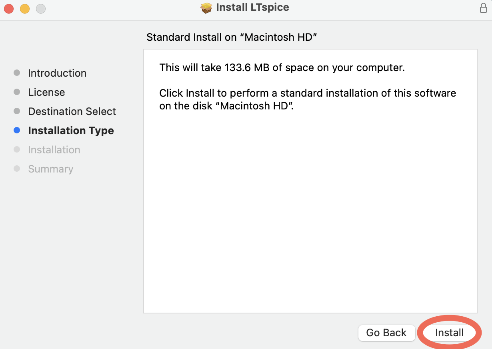
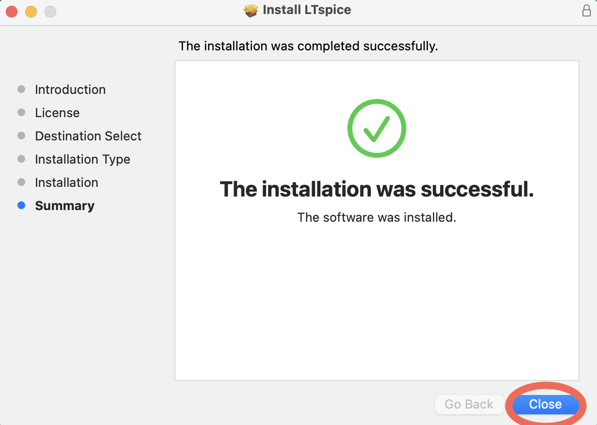
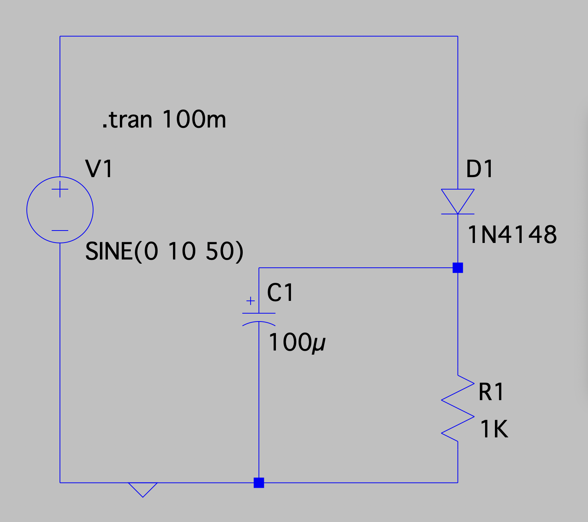
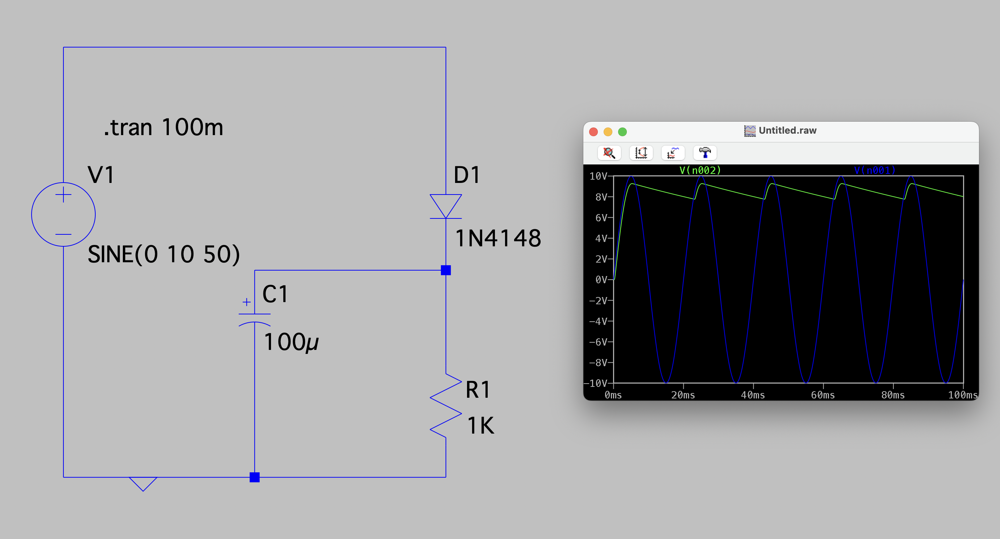

# نرم افزار های شبیه سازی و تحلیل مدار

<div style="display: flex; justify-content: start; align-items: center; gap: 10px; ">
    
</div>


## اطلاعات نویسنده
**نام:** نیایش اعظمی

**وابستگی:** گروه مهندسی کامپیوتر، دانشگاه فردوسی مشهد

**تماس:** niayesh.azami24@gmail.com


## فهرست مطالب
- [نرم افزار های شبیه سازی و تحلیل مدار](#نرم-افزار-های-شبیه-سازی-و-تحلیل-مدار)
  - [اطلاعات نویسنده](#اطلاعات-نویسنده)
  - [فهرست مطالب](#فهرست-مطالب)
  - [مقدمه](#مقدمه)
  - [بخش اول – معرفی و مقایسه نرم‌افزارهای شبیه‌سازی مدار](#بخش-اول--معرفی-و-مقایسه-نرمافزارهای-شبیهسازی-مدار)
    - [نرم افزار LTspice](#نرم-افزار-ltspice)
    - [نرم افزار Proteus VSM](#نرم-افزار-proteus-vsm)
    - [نرم افزار NI Multisim](#نرم-افزار-ni-multisim)
    - [نرم افزار Cadence PSpice](#نرم-افزار-cadence-pspice)
    - [پلتفرم MATLAB/Simulink (Simscape Electrical)](#پلتفرم-matlabsimulink-simscape-electrical)
    - [نرم افزار KiCad](#نرم-افزار-kicad)
    - [جدول مقایسه کلی](#جدول-مقایسه-کلی)
  - [آموزش و تمرکز بر نرم‌افزار LTspice](#آموزش-و-تمرکز-بر-نرمافزار-ltspice)
    - [مراحل ترسیم مدار در LTspice](#مراحل-ترسیم-مدار-در-ltspice)
    - [انواع آنالیزهای پایه و پیشرفته:](#انواع-آنالیزهای-پایه-و-پیشرفته)
      - [مراحل:](#مراحل)
      - [مراحل:](#مراحل-1)
      - [مراحل:](#مراحل-2)
      - [مراحل:](#مراحل-3)
  - [مثال کاربردی](#مثال-کاربردی)
    - [مثال: شبیه‌سازی یک یکسوساز و فیلتر](#مثال-شبیهسازی-یک-یکسوساز-و-فیلتر)
  - [نتیجه‌گیری](#نتیجهگیری)
  - [منابع](#منابع)


## مقدمه

در عصر حاضر، با افزایش پیچیدگی مدارها و هزینه‌های ساخت، استفاده از ابزارهای شبیه‌سازی الکتریکی و الکترونیکی به بخش جدایی‌ناپذیر فرآیند طراحی تبدیل شده است. شبیه‌سازی این امکان را فراهم می‌کند که عملکرد مدار پیش از ساخت فیزیکی به‌طور دقیق بررسی شود، نقاط ضعف احتمالی شناسایی گردند و اصلاحات لازم پیش از صرف زمان و هزینه‌ی واقعی انجام گیرد. از این‌رو، تسلط بر فرآیند شبیه‌سازی یکی از مهارت‌های بنیادی برای هر مهندس برق و الکترونیک محسوب می‌شود.
پروژه‌ی حاضر با عنوان «شبیه‌سازی و آنالیز مدار» در راستای درس مدار الکتریکی و الکترونیکی تدوین شده است. هدف اصلی این پروژه، آشنایی عملی با ابزارهای شبیه‌سازی، یادگیری روش‌های تحلیل مدار در محیط نرم‌افزاری و درک عمیق‌تر از رفتار واقعی مدارها در شرایط مختلف است. از طریق این پروژه، دانشجو می‌آموزد چگونه با بهره‌گیری از نرم‌افزارهای تخصصی، مدارهای مختلف را در محیطی مجازی طراحی، آزمایش و تحلیل کند و نتایج حاصل را به‌صورت علمی تفسیر نماید.

روند انجام پروژه در سه بخش اصلی برنامه‌ریزی شده است:

**۱. معرفی و مقایسه‌ی نرم‌افزارهای شبیه‌سازی**

در این بخش، نرم‌افزارهای مطرحی مانند LTspice، Proteus VSM، NI Multisim، PSpice، MATLAB/Simulink و KiCad از جنبه‌های مختلف شامل دقت و سرعت موتور شبیه‌سازی، گستره‌ی کتابخانه‌ی قطعات (آنالوگ، دیجیتال و Mixed-Signal)، انواع آنالیزهای قابل انجام و سهولت کاربری مورد بررسی و مقایسه قرار می‌گیرند. هدف از این بخش، انتخاب نرم‌افزاری مناسب برای ادامه‌ی فرآیند آموزش و تمرکز عملی است.

**۲. آموزش و تمرکز بر نرم‌افزار منتخب**

پس از ارزیابی نرم‌افزارها، تمرکز بر یکی از ابزارهای قدرتمند و رایگان مانند LTspice قرار خواهد گرفت. در این مرحله، نحوه‌ی نصب، آشنایی با محیط کاربری، ترسیم مدار و اجرای انواع آنالیزها از جمله DC Operating Point، Transient، AC Sweep و Fourier Analysisبه‌صورت گام‌به‌گام آموزش داده می‌شود. در این بخش، دانشجو با مفاهیم مهمی همچون نقطه‌ی کار DC، پاسخ زمانی، پاسخ فرکانسی و تحلیل اعوجاج هارمونیکی آشنا خواهد شد.

**۳. مثال‌های کاربردی و تحلیل پروژه‌محور**

برای تثبیت مفاهیم، مجموعه‌ای از مثال‌های عملی شامل شبیه‌سازی مدارهای یکسوساز و فیلتر، تقویت‌کننده‌ی ترانزیستوری، شمارنده‌ی دیجیتال و فیلتر فعال ارائه می‌شود. در هر مثال، مراحل طراحی، تنظیم پارامترهای آنالیز، مشاهده‌ی نمودارها و تفسیر نتایج به‌صورت دقیق و مستند تشریح خواهد شد.

در پایان، دانشجو قادر خواهد بود پیش از ساخت فیزیکی هر مدار، عملکرد آن را در محیط نرم‌افزاری تحلیل و ارزیابی کند. این توانایی نه تنها موجب صرفه‌جویی در زمان و هزینه می‌شود، بلکه درک عمیق‌تری از مفاهیم نظری و رفتار اجزای مدار در شرایط واقعی فراهم می‌سازد. در نتیجه، مهارت شبیه‌سازی و تحلیل مدار از ارکان اساسی در مسیر رشد و حرفه‌ای‌شدن مهندسان  به شمار می‌آید.

## بخش اول – معرفی و مقایسه نرم‌افزارهای شبیه‌سازی مدار
در فرآیند طراحی و تحلیل مدارهای الکتریکی، انتخاب نرم‌افزار شبیه‌سازی مناسب نقش تعیین‌کننده‌ای در کیفیت نتایج و سرعت پیشرفت کار دارد. هر نرم‌افزار با توجه به موتور شبیه‌سازی، دقت عددی، گستره‌ی کتابخانه‌ی قطعات و امکانات تحلیلی خود، برای نوع خاصی از پروژه‌ها کارایی بهتری دارد. به همین دلیل، پیش از شروع به آموزش و اجرای شبیه‌سازی عملی، لازم است محیط‌ها و ابزارهای مختلف به‌صورت دقیق مورد بررسی و مقایسه قرار گیرند تا بتوان بهترین گزینه را بر اساس نیازهای آموزشی و فنی انتخاب کرد.

در این بخش، مجموعه‌ای از نرم‌افزارهای مطرح در حوزه‌ی شبیه‌سازی مدار شامل LTspice، Proteus VSM، NI Multisim، PSpice، MATLAB/Simulink و KiCad مورد مطالعه قرار می‌گیرند. این نرم‌افزارها از لحاظ دقت شبیه‌سازی، سرعت محاسبات، نوع و گستردگی قطعات موجود، قابلیت انجام آنالیزهای متنوع (نظیر DC، AC، Transient و Fourier) و همچنین کاربرپسندی و سهولت استخراج نتایج با یکدیگر مقایسه خواهند شد.

هدف از این بخش، تنها معرفی ابزارها نیست، بلکه ایجاد درک تحلیلی از تفاوت‌ها و مزایای هر نرم‌افزار است تا بتوان بر اساس معیارهای فنی، نرم‌افزار منتخب پروژه را با آگاهی کامل برگزید. انتخاب صحیح در این مرحله، پایه‌ای محکم برای انجام دقیق و کارآمد مراحل بعدی پروژه فراهم می‌کند و از تکرار، خطا و دوباره‌کاری در فرآیند شبیه‌سازی جلوگیری خواهد کرد.

### نرم افزار LTspice
نرم افزار LTspice نرم‌افزاری رایگان از شرکت Analog Devices است که بر اساس موتور شبیه‌ساز SPICE عمل می‌کند و برای تحلیل مدارهای آنالوگ بهینه شده است. این نرم‌افزار شامل یک واسط کاربری شماتیک گرافیکی و نمایشگر موج (waveform viewer) سریع و کم‌حجم است. LTspice از تحلیل‌های متنوعی همچون تحلیل گذرا (Transient)، تحلیل DC، تحلیل AC، تحلیل نویز و تحلیل فازوری (Fourier) پشتیبانی می‌کند. همچنین دارای مدل‌های بهینه‌شده‌ی سوئیچینگ برای شبیه‌سازی منابع تغذیه سوئیچینگ (SMPS) است. از مزایای آن می‌توان به سرعت بالای شبیه‌سازی، دقت مناسب در مدارهای قدرت و سوئیچینگ، و عدم محدودیت در تعداد اجزاء یا شبکه‌ها اشاره کرد (نسخه رایگان و بدون محدودیت). با این حال، LTspice محدودیت‌هایی نیز دارد: برای مدارهای دیجیتال پیچیده مناسب نیست و قابلیت تولید اتوماتیک PCB (طرح‌بندی مدار چاپی) ندارد. همچنین محیط کاربری آن ممکن است برای برخی کاربران خوشایند نباشد. این نرم‌افزار به ویژه برای طراحی و تحلیل مدارهای آنالوگ و منابع تغذیه سوئیچینگ (صنعتی و آموزشی) مناسب است. به دلیل رایگان بودن و گستردگی استفاده صنعتی، LTspice در دانشگاه‌ها، مراکز تحقیقاتی و طراحی‌های صنعتی بسیار محبوب است.

### نرم افزار Proteus VSM

نرم افزار Proteus Virtual System Modelling نرم‌افزاری تجاری از شرکت Labcenter است که شبیه‌ساز سیستم‌های جاسازی‌شده(Embedded) همراه با مدار را فراهم می‌کند. ویژگی کلیدی Proteus VSM ادغام هم‌زمان موتور SPICE و شبیه‌ساز میکروکنترلر است؛ به طوری که می‌توان کد اجرایی میکروکنترلر را روی شماتیک مدار بارگذاری و اجرا کرد. این نرم‌افزار با بیش از ۷۵۰ مدل میکروپروسسور و هزاران مدل قطعه استاندارد و جانبی (سنسورها، نمایشگرها، پروتکل‌ها و …) همراه است. همچنین دارای ابزارهای مجازی اندازه‌گیری مانند اسیلوسکوپ، آنالایزر منطقی، مولد سیگنال و پروتکل‌آنالیزور است. از مزایای Proteus می‌توان به امکان اشکال‌زدایی هم‌زمان کد و مدار (به کمک توقف نقطه و قدم به قدم زدن در کد)، سهولت آزمون مدارهای امبدد و کاهش نیاز به نمونه‌سازی فیزیکی اشاره کرد. به‌علاوه رابط کاربری شماتیک آن نسبتاً ساده و قابل فهم است. معایب Proteus شامل عدم رایگان بودن (نیاز به دریافت لایسنس تجاری، اگرچه نسخه‌ی دمو رایگان با امکانات محدود ارائه می‌شود)، پشتیبانی محدود از سیستم‌عامل (اغلب فقط ویندوز) و تمرکز بیشتر روی مدارات دیجیتال/امبدد نسبت به تحلیل‌ عمیق آنالوگ است. Proteus برای پروژه‌های آموزشی و صنعتی جاسازی‌شده ایده‌آل است و در درس‌های طراحی میکروکنترلر، الکترونیک دیجیتال و پروتکل‌های ارتباطی کارایی دارد. در طراحی‌های دیجیتال مختلط و میکروکنترلری، به‌ویژه در موقعیت‌ هایی که نمونه‌سازی مجازی کل سیستم همراه با کد مهم است، کاربرد دارد.

### نرم افزار NI Multisim

نرم افزار NI Multisim (قبلاً Electronics Workbench) یک نرم‌افزار تجاری شبیه‌ساز مدار است که هم در آموزش و هم در صنعت کاربرد دارد. Multisim همزمان شبیه‌سازی SPICE استاندارد را با محیط شماتیک تعاملی ترکیب می‌کند. این نرم‌افزار از هر دو دامنه آنالوگ، دیجیتال و قدرت پشتیبانی می‌کند و برای درس‌های دانشگاهی مدار الکتریکی، الکترونیک دیجیتال و طراحی بردهای PCB به‌کار می‌رود. از ویژگی‌های بارز Multisim می‌توان به کتابخانه‌ی بزرگ قطعات (بیش از ۱۴۰۰۰ قطعه شامل قطعات ساختگی و واقعی از تولیدکنندگان معتبر)، ابزارهای مجازی اندازه‌گیری (اسیلوسکوپ، مولتی‌متر، سیگنال‌ژنراتور) و قابلیت استفاده آسان اشاره کرد. این نرم‌افزار امکان قیود طراحی، تحلیل پارامتریک، شبیه‌سازی چندبرگه (مجموعه مدارهای متصل) و ارتباط با سخت‌افزار NI ELVIS (بُردهای آموزشی) را دارد. از مزایای Multisim می‌توان به سادگی کاربری، هم‌پوشانی خوب با نیازهای آموزشی و ارائه ابزارهای آموزشی (مانند برد آردینو، FPGA، محیط بردبورد سه‌بعدی) اشاره کرد. علاوه بر آموزش، Multisim در طراحی صنعتی نیز قابل استفاده است، زیرا امکانات حرفه‌ای نظیر طراحی هِرارشی پروژه، جریان اتوماتیک مدار (wizards) و پشتیبانی از PCB را دارد. معایب Multisim شامل هزینه بالای لایسنس (هرچند نسخه‌های آموزشی و آزمایشی با امکانات محدود وجود دارد)، سیستم‌عامل فقط ویندوز و سرعت نسبی پایین در مدارهای بسیار بزرگ است. به طور کلی، Multisim مخصوصاً برای محیط‌های آموزشی و افرادی که نیاز به شبیه‌سازی سریع و آسان مدارها دارند مناسب است؛ همچنین می‌توان در تحقیقات دانشگاهی و پروتوتایپ‌سازی سریع بردهای الکترونیکی از آن استفاده کرد.

### نرم افزار Cadence PSpice
نرم افزار PSpice از محصولات Cadence یک نرم‌افزار قدرتمند تجاری برای شبیه‌سازی مدارهای آنالوگ و مخلوط (mixed-signal) است. از ویژگی‌های مهم آن می‌توان به مجموعه‌ی بزرگ مدل‌های قطعات (بیش از ۳۵۰۰۰ مدل پارامتری از دیود، ترانزیستور تا کنترل‌کننده‌های PWM)، و امکانات تحلیل پیشرفته مانند تحلیل حساسیت، مونت‌کارلو، تحلیل دود (Smoke Analysis) و بررسی نقاط بحرانی اشاره کرد. PSpice «استاندارد طلایی» حوزه طراحی آنالوگ/مخلوط محسوب می‌شود و برای تحلیل‌های دقیق مدارهای با دقت بالا (مثلاً در صنایع خودرو و منابع تغذیه) به کار می‌رود. از مزایای این نرم‌افزار می‌توان به دقت شبیه‌سازی بالا (یکی از دقیق‌ترین شبیه‌سازها در بازار)، یکپارچگی با OrCAD Capture (برای شماتیک) و قابلیت‌های گسترده در تحلیل و اعتبارسنجی طرح اشاره کرد. معایب PSpice عبارتند از هزینه بالای لایسنس تجاری، منابع محاسباتی زیاد (با مدارهای بزرگ و تحلیل‌های سنگین)، و محدودیت نسخه‌های رایگان (برای مثال نسخه‌ی PSpice for TI رایگان محدود به مدل‌های TI است و نسخه عمومی رایگان دارد محدودیت در تعداد قطعات و سرعت). PSpice بیشتر در کاربردهای صنعتی و تحقیقاتی جدی، به خصوص در طراحی منابع تغذیه، RF و آنالوگ دقیق استفاده می‌شود؛ در دانشگاه نیز برای دروس حرفه‌ای می‌تواند مورد استفاده قرار گیرد. در کل، PSpice و نسخه‌های مرتبط (TI) تعادلی از دقت بالا و کتابخانه گسترده با هزینه/پیچیدگی بیشتر فراهم می‌کنند.


### پلتفرم MATLAB/Simulink (Simscape Electrical)

پلتفرم MATLAB و به‌ویژه Simulink (با افزودنی Simscape Electrical) یک پلتفرم قدرتمند بلوک‌محور چند دامنه است. Simulink یک محیط شبیه‌سازی مبتنی بر بلوک (نمودارهای بلوکی) است که امکان مدل‌سازی، شبیه‌سازی و تولید کد سیستم‌های پیچیده را فراهم می‌کند. با استفاده از Simscape Electrical (سابقاً SimPowerSystems/SimElectronics) می‌توان مدارهای الکترونیکی و سیستم‌های قدرت را شبیه‌سازی کرد؛ این کتابخانه شامل قطعات نیمه‌هادی، موتورها و اجزای شبکه‌های قدرت است. این ابزار برای شبیه‌سازی سلسله‌مراتبی سیستم‌های الکترونیکی همراه با کنترل (مثلاً طراحی منطق کنترل موتور، منابع تغذیه، شبکه‌های هوشمند) مناسب است. از مزایای MATLAB/Simulink می‌توان به امکان ترکیب دامنه‌های مختلف فیزیکی (الکتریکی، مکانیکی، حرارتی و …)، تحلیل سیستم‌های سطح بالا، تولید خودکار کد و پشتیبانی از شبیه‌سازی در حلقه‌ی سخت‌افزار (HIL) اشاره کرد. این ابزار در تحقیقات دانشگاهی و صنایع (خودرو، انرژی‌های تجدیدپذیر، سیستم‌های کنترلی و…) کاربرد فراوان دارد. معایب آن شامل هزینه بالای لایسنس (حتی نسخه‌های دانشجویی)، منحنی یادگیری نسبتاً طولانی و سنگین بودن برای شبیه‌سازی‌های ساده مدار (مناسب‌تر برای مدل‌های پیچیده سیستمی) است. در مجموع، MATLAB/Simulink برای مطالعات سیستم‌های قدرت، الکترونیک قدرت، شبیه‌سازی کنترل و طراحی سیستم‌های چندرشته‌ای مناسب است، نه برای طراحی سریع مدارهای کوچک آنالوگ یا دیجیتال؛ با این حال، افزونه‌های مربوطه (از قبیل Simscape Electrical) امکاناتی برای تحلیل مدارهای الکترونیکی فراهم می‌کنند.

### نرم افزار KiCad

نرم افزار KiCad یک نرم‌افزار متن‌باز و رایگان برای طراحی شماتیک و PCB است که قابلیت شبیه‌سازی SPICE را نیز فراهم می‌کند. KiCad با استفاده از شبیه‌ساز متن‌باز ngspice امکان شبیه‌سازی مدارها را مستقیماً در محیط شماتیک ارائه می‌دهد. این نرم‌افزار از مدل‌های SPICE استاندارد و حتی برخی مدل‌های LTspice، PSpice و HSPICE پشتیبانی می‌کند. وضعیت شبیه‌سازی در KiCad شامل تحلیل‌های پایه مانند Sweep AC، نقطه کار DC، ترانزیِنت و امکان تعریف تحلیل‌های دلخواه است. کاربر می‌تواند پس از شبیه‌سازی، با ابزار پروب داخل کی‌کد ولتاژ و جریان گره‌ها را مشاهده کند. از مزایای KiCad می‌توان به رایگان و متن‌باز بودن، ادغام نزدیک با جریان طراحی PCB و انعطاف در وارد کردن مدل‌های SPICE اشاره کرد. معایب عمده‌ی آن عبارتند از کتابخانه‌ی محدود مدل‌های SPICE (کی‌کد مدل‌های آماده از سازندگان را ندارد)، امکانات محدود تحلیل (فاقد ابزارهای آماری پیشرفته) و گاهی رابط کاربری نه چندان شهودی برای شبیه‌سازی. KiCad بیشتر برای کاربردهای آموزشی، پژوهشی و طراحی آزاد مناسب است؛ به‌ویژه زمانی که کاربر نیاز به ابزار متن‌باز و رایگان دارد و یا قصد پیاده‌سازی سریع مدارهای نسبتاً ساده را در کنار طراحی PCB دارد. برخلاف ابزارهای تجاری بزرگ، KiCad گزینه‌ی مناسبی برای مبتدیان، دانشجویان و هابیست‌هاست.


### جدول مقایسه کلی

| نرم‌افزار                              | نوع لایسنس             | حوزه شبیه‌سازی               | مزایا                                                        | محدودیت‌ها                                                      | مناسب برای                              |
| ------------------------------------- | ---------------------- | --------------------------- | ------------------------------------------------------------ | -------------------------------------------------------------- | --------------------------------------- |
| LTspice                               | رایگان (Freeware)      | آنالوگ، مخلوط               | سریع و دقیق برای مدارهای آنالوگ، کتابخانه مدل غنی            | محدود در شبیه‌سازی دیجیتال و PCB                                | طراحی آنالوگ و پاور، تحقیق و صنعت       |
| Proteus VSM                           | تجاری (با دمو رایگان)  | مخلوط، امبدد                | شبیه‌سازی همزمان HW/SW، مجموعه مدل‌های MCU گسترده              | هزینه لایسنس، فقط ویندوز، کمتر برای آنالوگ خالص                | طراحی سیستم‌های امبدد، آموزش MCU         |
| NI Multisim                           | تجاری (آموزشی)         | آنالوگ، دیجیتال             | رابط کاربری تعاملی، کتابخانه بزرگ قطعات، امکانات آموزشی      | لایسنس تجاری، سنگین در مدارهای بسیار پیچیده                    | آموزش الکترونیک، طراحی برد PCB          |
| Cadence PSpice                        | تجاری (نسخه رایگان TI) | آنالوگ، مخلوط               | دقت بالا، کتابخانه عظیم مدل، تحلیل‌های پیشرفته                | هزینه بالا، پیچیدگی کاربری، محدودیت نسخه رایگان                | طراحی حرفه‌ای مدارهای آنالوگ/مخلوط       |
| MATLAB/Simulink (Simscape Electrical) | تجاری (کاربرد عمومی)   | چندرشته‌ای (الکتریکی، کنترل) | قدرتمند برای سیستم‌های پیچیده، ادغام با کنترل و داده‌های واقعی | هزینه بالا، کاربر نیاز به آموزش زیاد، مناسب‌تر برای مدل‌های بزرگ | تحقیق و توسعه سیستم‌های الکتریکی و کنترل |
| KiCad                                 | رایگان، متن‌باز         | آنالوگ (از طریق ngspice)    | رایگان و متن‌باز، یکپارچه با طراحی PCB                        | کتابخانه مدل محدود، امکانات تحلیل ساده                         | آموزش و طراحی آزاد مدارهای ساده         |

## آموزش و تمرکز بر نرم‌افزار LTspice
در این بخش از پروژه، تمرکز اصلی بر یادگیری عملی شبیه‌سازی مدار با استفاده از نرم‌افزار **LTspice** قرار دارد. این نرم‌افزار که توسط شرکت Analog Devices توسعه یافته، یکی از پرکاربردترین ابزارهای شبیه‌سازی مدار در سطح دانشگاهی و صنعتی است و به‌دلیل رایگان بودن، دقت بالا و سادگی محیط کاربری، گزینه‌ای ایده‌آل برای آموزش و تحلیل مدارهای الکترونیکی به شمار می‌آید.
در این مرحله، فرآیند آموزش به‌صورت گام‌به‌گام انجام می‌شود تا دانشجو بتواند به‌طور کامل با محیط نرم‌افزار، نحوه‌ی ترسیم مدار، انجام تحلیل‌های مختلف و تفسیر نتایج آشنا شود. از آن‌جایی که نرم‌افزار LTspice برای هر دو سیستم‌عامل Windows و macOS عرضه شده است، در این پروژه مراحل نصب و اجرای تمرین‌ها در محیط macOS انجام خواهد گرفت.

در ابتدا برای دانلود نرم افزار وارد این [لینک](https://www.analog.com/en/resources/design-tools-and-calculators/ltspice-simulator.html?ADICID=PDSR_Global_LTspice-NB_Google_PSC_202508&gad_source=1&gad_campaignid=22826770531&gbraid=0AAAAACxqTx8URqXO4-nd_Pnu18E5V3Ufy&gclid=CjwKCAjwx-zHBhBhEiwA7Kjq63kQ7wDX_PR1VarMX74kfMB3DgQJgeC2zncXKuoGQXStiH-nGubz0RoC3X8QAvD_BwE) می‌شویم.

سپس همانند تصویر زیر بر روی Download for MacOS کلیک می‌کنیم و منتظر دانلود نرم افزار می‌مانیم.

<div align="center">

  <figure>
    
    <figcaption><b>شکل ۱ – صفحه‌ی نصب LTspice در macOS</b></figcaption>
  </figure>

</div>

سپس فایل دانلود شده را باز کرده و طبق مراحل پیش می‌رویم.

ابتدا روی گزینه Continue کلیک می‌کنیم.
<div align="center">

  <figure>
    
    <figcaption><b>شکل ۲ – مراحل نصب LTspice در macOS</b></figcaption>
  </figure>

</div>

سپس برای تایید License Agreement نرم افزار دوباره بر روی گزینه Continue و سپس بر روی Agree کلیک میکنیم.
<div align="center">

  <figure>
    <div style="display: flex; justify-content: center; gap: 20px;">
      
      
    </div>
    <figcaption><b>شکل ۳ – مراحل نصب LTspice در macOS</b></figcaption>
  </figure>

</div>

و برای نصب گزینه Install را انتخاب می‌کنیم و منتظر می‌مانیم تا فرایند نصب کامل شود.

<div align="center">

  <figure>
    <div style="display: flex; justify-content: center; gap: 20px;">
      
    </div>
    <figcaption><b>شکل ۴ – مراحل نصب LTspice در macOS</b></figcaption>
  </figure>

</div>

و در نهایت پس از اتمام نصب بر روی Close کلیک می‌کنیم. 
<div align="center">

  <figure>
    <div style="display: flex; justify-content: center; gap: 20px;">
      
    </div>
    <figcaption><b>شکل ۵ – مراحل نصب LTspice در macOS</b></figcaption>
  </figure>

</div>

حال می‌توانیم در پوشه Application، نرم افزار LTspice را پیدا کنیم.
<div align="center">

  <figure>
    <div style="display: flex; justify-content: center; gap: 20px;">
      
    </div>
    <figcaption><b>شکل ۶ – مراحل نصب LTspice در macOS</b></figcaption>
  </figure>

</div>

### مراحل ترسیم مدار در LTspice
**۱. ایجاد پروژه جدید**

**اجرای LTspice:** پس از نصب، برنامه را از پوشه Applications باز کنید.

**ایجاد شمای جدید:** از منوی بالای صفحه، گزینه‌ی File > New Schematic را انتخاب کنید تا یک صفحه خالی برای طراحی مدار جدید باز شود.

---

**۲. افزودن اجزای مدار**

**انتخاب اجزا:** با راست کلیک کردن بر روی صفحه و انتخاب گزینه Draft > Component پنجره‌ای برای انتخاب اجزا باز می‌شود.

**جستجوی اجزا:** در پنجره‌ی باز شده، نام جزء مورد نظر (مثلاً "R" برای مقاومت، "C" برای خازن، "Q" برای ترانزیستور) را وارد کنید و سپس آن را انتخاب کنید.

**قرار دادن جزء:** پس از انتخاب، مکان‌نما به شکل جزء تغییر می‌کند. با کلیک در صفحه، جزء را در مکان دلخواه قرار دهید.

**ویرایش ویژگی‌ها:** برای تغییر ویژگی‌های جزء (مانند مقدار مقاومت یا ظرفیت)، روی آن راست کلیک کنید و مقادیر مورد نظر را وارد کنید.

---

**۳. اتصال اجزا با سیم**

**انتخاب ابزار سیم‌کشی:** از منوی Draft > Wire ابزار سیم‌کشی را فعال کنید.

**اتصال اجزا:** با کلیک در نقاط اتصال اجزا، سیم‌ها را بکشید و اجزا را به هم متصل کنید.

**خاتمه اتصال:** پس از اتمام، کلید Esc را فشار دهید تا ابزار سیم‌کشی غیرفعال شود.

---

**۴. نام‌گذاری گره‌ها (Nets)**

**انتخاب ابزار نام‌گذاری:** از منوی Draft > Net Name، ابزار نام‌گذاری گره‌ها را فعال کنید.

**قرار دادن نام:** نام مورد نظر یا نوع گره را مشخض کنید.

**تایید نام:** پس از وارد کردن نام، کلید Enter را فشار دهید و بر روی گره یا گره های مورد نظر کلیک کنید.

---

**۵. افزودن دستور شبیه‌سازی**

**انتخاب دستور شبیه‌سازی:** از منوی Draft > Spice Directive، پنجره‌ای برای وارد کردن دستور شبیه‌سازی باز می‌شود.

**وارد کردن دستور:** در پنجره، دستور شبیه‌سازی مورد نظر (مانند .op برای تحلیل نقطه کاری، .tran برای تحلیل گذرا) را وارد کنید.

**قرار دادن دستور:** پس از وارد کردن دستور، مکان‌نما به شکل دستور تغییر می‌کند. با کلیک در صفحه، دستور را در مکان دلخواه قرار دهید.

---

**۶. ذخیره شمای مدار**

**ذخیره فایل:** از منوی File > Save As، نامی برای فایل وارد کنید و مکان ذخیره‌سازی را انتخاب کنید.

**انتخاب فرمت:** فرمت پیش‌فرض .asc برای فایل‌های شمای مدار است. این فرمت را نگه دارید.

---

**۷. اجرای شبیه‌سازی**

**اجرای شبیه‌سازی:** پس از اتمام طراحی مدار، برای اجرای شبیه‌سازی، از منوی بالای صفحه، روی آیکون Run (شبیه به یک مرد در حال دویدن) کلیک کنید.

**مشاهده نتایج:** پس از اجرای شبیه‌سازی، پنجره‌ای برای نمایش نتایج شبیه‌سازی باز می‌شود. می‌توانید نمودارهای مختلف مانند ولتاژ یا جریان را مشاهده کنید.

---

**نکات مهم در طراحی مدار در LTspice**

**استفاده از اجزای استاندارد:** برای اطمینان از صحت شبیه‌سازی، از اجزای استاندارد و معتبر استفاده کنید.

**نام‌گذاری دقیق گره‌ها:** نام‌گذاری دقیق گره‌ها به فهم بهتر مدار و شبیه‌سازی صحیح کمک می‌کند.

**بررسی اتصال سیم‌ها:** اطمینان حاصل کنید که تمام اجزا به درستی به هم متصل شده‌اند و هیچ سیمی بدون اتصال باقی نمانده است.

**استفاده از دستورات شبیه‌سازی مناسب:** بسته به نوع تحلیل مورد نظر (DC، AC، Transient)، دستور شبیه‌سازی مناسب را وارد کنید.

### انواع آنالیزهای پایه و پیشرفته:
**۱. تحلیل نقطه کاری DC (.op)**

**هدف:**
محاسبه وضعیت پایدار ولتاژ و جریان در حالت DC مدار.

#### مراحل:

**افزودن دستور شبیه‌سازی:**
از منوی Draft > Spice Directive یا با فشردن کلید میان‌بر S، پنجره‌ای برای وارد کردن دستور شبیه‌سازی باز می‌شود.
در پنجره، دستور .op را وارد کنید.
در صفحه شمای مدار، کلیک کنید تا دستور در مکان دلخواه قرار گیرد.

**اجرای شبیه‌سازی:**
روی آیکون Run (شبیه به یک مرد در حال دویدن) در نوار ابزار کلیک کنید.
در پنجره باز شده، نتایج تحلیل نقطه کاری DC نمایش داده می‌شود.

**مشاهده نتایج:**
در پنجره نتایج، مقادیر ولتاژ و جریان در هر گره و جزء مدار نشان داده می‌شود.

---

**۲. تحلیل گذرا (.tran)**

**هدف:**
مشاهده تغییرات ولتاژ و جریان در مدار در طول زمان.

#### مراحل:

**افزودن دستور شبیه‌سازی:**
از منوی Draft > Spice Directive یا با فشردن کلید میان‌بر S، پنجره‌ای برای وارد کردن دستور شبیه‌سازی باز می‌شود.
در پنجره، دستور .tran 1ms را وارد کنید.
در اینجا، 1ms مدت زمان شبیه‌سازی است که می‌توانید آن را بر اساس نیاز خود تغییر دهید.
در صفحه شمای مدار، کلیک کنید تا دستور در مکان دلخواه قرار گیرد.

**اجرای شبیه‌سازی:**
روی آیکون Run در نوار ابزار کلیک کنید.
در پنجره باز شده، نتایج تحلیل گذرا نمایش داده می‌شود.

**مشاهده نتایج:**
در پنجره نتایج، می‌توانید تغییرات ولتاژ و جریان در طول زمان را مشاهده کنید.

---

**۳. تحلیل AC Sweep (.ac)**

**هدف:**
تحلیل پاسخ فرکانسی مدار و مشاهده نحوه تغییرات ولتاژ یا جریان با تغییر فرکانس.

#### مراحل:

**افزودن دستور شبیه‌سازی:**
از منوی Draft > Spice Directive یا با فشردن کلید میان‌بر S، پنجره‌ای برای وارد کردن دستور شبیه‌سازی باز می‌شود.
در پنجره، دستور زیر را وارد کنید:

 ```.ac dec 100 1k 100Meg ``` 

dec: نوع گام‌بندی فرکانس (در اینجا لگاریتمی).

100: تعداد نقاط در هر دهه.

1k: فرکانس شروع (1 کیلوهرتز).

100Meg: فرکانس پایان (100 مگاهرتز).

در صفحه شمای مدار، کلیک کنید تا دستور در مکان دلخواه قرار گیرد.

**اجرای شبیه‌سازی:**
روی آیکون Run در نوار ابزار کلیک کنید.
در پنجره باز شده، نتایج تحلیل AC Sweep نمایش داده می‌شود.

**مشاهده نتایج:**
در پنجره نتایج، می‌توانید نمودارهای پاسخ فرکانسی مانند Bode plot را مشاهده کنید. 

---

**۴. تحلیل فوریه (.four)**

**هدف:**
تجزیه سیگنال‌های پیچیده به مؤلفه‌های فرکانسی و بررسی اعوجاج‌های هارمونیکی.

#### مراحل:

**افزودن دستور شبیه‌سازی:**
از منوی Draft > Spice Directive یا با فشردن کلید میان‌بر S، پنجره‌ای برای وارد کردن دستور شبیه‌سازی باز می‌شود.
در پنجره، دستور زیر را وارد کنید:

 ```.four 1kHz V(out) ``` 

1kHz: فرکانس پایه برای تحلیل فوریه.

V(out): سیگنال خروجی که می‌خواهید تجزیه فوریه آن را انجام دهید.

در صفحه شمای مدار، کلیک کنید تا دستور در مکان دلخواه قرار گیرد.

**اجرای شبیه‌سازی:**
روی آیکون Run در نوار ابزار کلیک کنید.
در پنجره باز شده، نتایج تحلیل فوریه نمایش داده می‌شود.

**مشاهده نتایج:**
در پنجره نتایج، می‌توانید مؤلفه‌های فرکانسی سیگنال خروجی را مشاهده کنید.

## مثال کاربردی

برای تثبیت مفاهیم شبیه‌سازی و تحلیل مدار، در این بخش یک مثال ارائه شده است.


### مثال: شبیه‌سازی یک یکسوساز و فیلتر

**هدف:** مشاهده ripple خروجی.

**قطعات:** 

۱. منبع AC: قطعه Voltage را انتخاب می‌کنیم. با راست کلیک بر روی قطعه offset = 0 - Amplitude = 10 - Freq = 50 قرار می‌دهیم.

۲.دیود: قطعه Diode را انتخاب می‌کنیم. با راست کلیک بر روی قطعه و انتخاب گزینه Pick New Diode، مدل 1N4148 را انتخاب می‌کنیم.

۳.مقاومت: قطعه Resistor را انتخاب می‌کنیم. با راست کلیک بر روی قطعه اندازه R = 1kΩ را برای آن در نظر میگیریم.

۴.خازن فیلتر: قطعه Capacitor را انتخاب می‌کنیم. با راست کلیک بر روی قطعه اندازه C = 100µF را برای آن در نظر میگیریم.


**شبیه سازی:** 
سپس شبیه سازی را باایم دستور قرار می‌دهیم:
 ```.tran 100m ``` 

<div align="center">

  <figure>
    <div style="display: flex; justify-content: center; gap: 20px;">
      
    </div>
    <figcaption><b>شکل ۷ – تصویر نهایی مدار</b></figcaption>
  </figure>

</div>

 **اجرا:** 
 سپس برنامه را اجرا میکنیم. با کلیک کردن بر روی هر قسمتی از مدار میتوان طول موج را مشاهده کرد. 


<div align="center">

  <figure>
    <div style="display: flex; justify-content: center; gap: 20px;">
      
    </div>
    <figcaption><b>شکل ۸ – خروجی مدار</b></figcaption>
  </figure>

</div>

## نتیجه‌گیری

در این پروژه با هدف آشنایی و تسلط بر مفاهیم پایه‌ای شبیه‌سازی مدارها، ابتدا به معرفی نرم‌افزارها و روش‌های مختلف شبیه‌سازی پرداختیم. در این مرحله یاد گرفتیم که هر نرم‌افزار، بسته به نوع کاربرد، دقت، سرعت و گستردگی کتابخانه قطعات، مزایا و محدودیت‌های خاص خود را دارد.

در ادامه، تمرکز اصلی ما بر روی نرم‌افزار LTspice بود؛ ابزاری قدرتمند و رایگان که در صنعت الکترونیک نیز به‌طور گسترده استفاده می‌شود. در طول کار با این نرم‌افزار، با محیط ترسیم مدار، نحوه تعریف منابع، افزودن قطعات و اجرای انواع تحلیل‌ها از جمله تحلیل DC، گذرا (Transient) و AC Sweep آشنا شدیم. همچنین یاد گرفتیم چگونه از نمودارهای خروجی برای بررسی رفتار مدارها در شرایط مختلف استفاده کنیم.

هدف اصلی پروژه، یعنی درک اهمیت شبیه‌سازی پیش از ساخت مدار واقعی، به‌خوبی محقق شد. با تجربه کار در محیط نرم‌افزار، مشاهده کردیم که شبیه‌سازی می‌تواند به‌عنوان مرحله‌ای ضروری در طراحی مدارها به ما کمک کند تا قبل از صرف هزینه و زمان برای ساخت، از درستی عملکرد مدار اطمینان حاصل کنیم.

در مجموع، این پروژه موجب شد تا علاوه بر آشنایی با یکی از ابزارهای مهم مهندسی الکترونیک، درک عمیق‌تری از ارتباط میان تئوری و پیاده‌سازی عملی مدارها پیدا کنیم. مهارتی که در پروژه‌های بعدی — چه در طراحی، چه در تحلیل و چه در بهینه‌سازی — بسیار کاربردی و ارزشمند خواهد بود.

## منابع
https://www.analog.com/en/resources/design-tools-and-calculators/ltspice-simulator.html

https://www.ni.com/en-us/shop/electronic-test-instrumentation/application-software-for-electronic-test-and-instrumentation-category/what-is-multisim.html

https://www.labcenter.com/simulation/

https://www.cadence.com/en_US/home/tools/pcb-design-and-analysis/pspice.html

https://www.mathworks.com/products/simscape-electrical.html

https://docs.kicad.org/